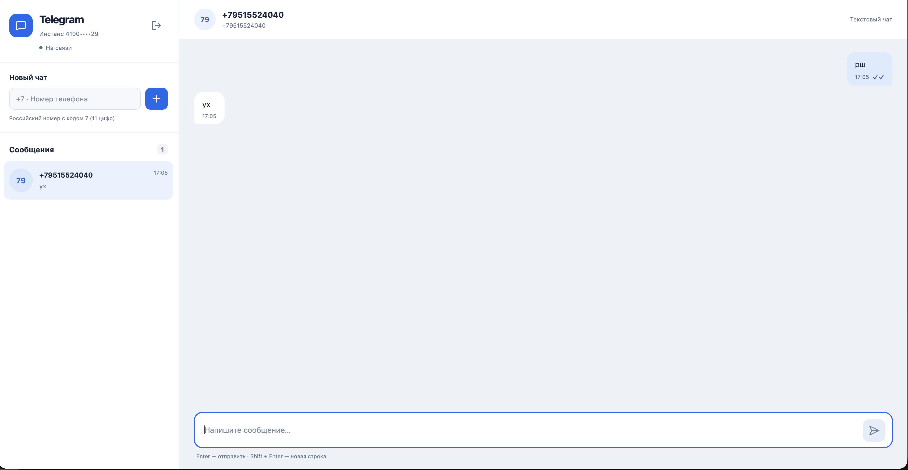

# GREEN-API Chat

Веб-чат для отправки и получения текстовых сообщений через HTTP API сервиса [GREEN-API](https://green-api.com/). Пользователь выбирает мессенджер, вводит данные своего инстанса, открывает чат по номеру телефона и переписывается: исходящие уходят методом `SendMessage`, входящие приходят из очереди уведомлений (`ReceiveNotification` и `DeleteNotification`). Интерфейс повторяет привычный вид чата web.max.ru.

**Демо:** <https://niko-web-dev.github.io/green-api-test/>



## Возможности и статус поддержки мессенджеров

В одном приложении доступны три мессенджера. Выбор делается на экране входа, у каждого мессенджера свой инстанс GREEN-API и свои учётные данные. Это не массовая рассылка: в каждый момент работает одна сессия и один инстанс.

| Мессенджер | Статус                                                                                                                                                                                                          |
| ---------- | --------------------------------------------------------------------------------------------------------------------------------------------------------------------------------------------------------------- |
| Telegram   | Проверен вживую на GitHub Pages: отправка, получение, цитирование, ссылки, переподключение при оффлайне, статусы доставки.                                                                                      |
| WhatsApp   | Проверен вживую на GitHub Pages: отправка, получение, статусы.                                                                                                                                                  |
| MAX        | Реализован в строгом соответствии с официальной документацией GREEN-API, покрыт автотестами на фикстурах из документации. Вживую не проверялся: у автора нет тестового номера MAX, поэтому полной гарантии нет. |

Что умеет приложение:

- вход по `apiUrl`, `idInstance` и `apiTokenInstance` с проверкой состояния инстанса: неавторизованный, заблокированный или запускающийся инстанс отсекается понятным сообщением до открытия чата;
- создание чата по номеру телефона (принимаются только российские номера: код 7 и 11 цифр) с проверкой, что номер зарегистрирован в выбранном мессенджере;
- отправка текста: Enter отправляет, Shift+Enter переносит строку, длина проверяется по лимиту мессенджера (MAX — 4000, Telegram — 4096, WhatsApp — 20000 символов);
- получение входящих текстовых сообщений, включая сообщения со ссылками и цитатами; если пишет собеседник, которого нет в списке, чат создаётся автоматически;
- статусы исходящих сообщений: принято API, доставлено, прочитано; при ошибке отправки сообщение остаётся в ленте с кнопкой «Повторить», а при неизвестном результате (оборвалась сеть, API не подтвердил отправку) повтор делается только вручную с предупреждением о возможном дубле;
- индикатор соединения («На связи», «Переподключение», «Ошибка соединения», «В другой вкладке»);
- адаптивная вёрстка: на узком экране показывается либо список чатов, либо переписка.

Чего приложение сознательно не делает: медиа и файлы, группы, историю с сервера, поиск, хранение переписки между сессиями (сообщения живут только в памяти вкладки).

## Быстрый старт

Требуется Node.js 22.12 или новее (версия для разработки указана в `.nvmrc`).

```bash
git clone https://github.com/niko-web-dev/green-api-test.git
cd green-api-test
npm ci
npm run dev
```

После запуска откройте адрес, который выведет Vite (по умолчанию <http://localhost:5173/>).

Проверка качества:

```bash
npm run lint        # ESLint
npm run typecheck   # tsc в строгом режиме
npm test            # Vitest, 281 тест
npm run build       # проверка типов и production-сборка в dist/
```

`npm run preview` запускает локальный предпросмотр собранной версии, `npm run format` форматирует код Prettier. Те же четыре проверки выполняются в GitHub Actions на каждом pull request и на `main`; после успешной проверки на `main` сборка публикуется на GitHub Pages.

## Настройка инстанса в личном кабинете GREEN-API

Для работы нужен собственный инстанс нужного мессенджера: инстансы Telegram, WhatsApp и MAX создаются отдельно, общих учётных данных у них нет.

1. Зарегистрируйтесь в [личном кабинете GREEN-API](https://console.green-api.com/) и создайте инстанс нужного мессенджера. Подойдёт бесплатный тариф Developer.
2. В карточке инстанса возьмите три значения: `apiUrl` (адрес API вашего инстанса, например `https://4100.api.green-api.com`), `idInstance` и `apiTokenInstance`. Адрес по умолчанию, который подставляет экран входа, — лишь ориентир; используйте адрес из кабинета.
3. Авторизуйте инстанс по QR-коду: отсканируйте его в приложении мессенджера с аккаунта, от имени которого будет вестись переписка. Для MAX в приложении должен быть отключён пароль входа. Пока инстанс не авторизован, вход в чат вернёт сообщение об этом.
4. **`webhookUrl` в настройках инстанса должен быть пустым.** Если задан вебхук, сервис отправляет события на него, и HTTP-очередь, из которой читает приложение, не наполняется. Приложение распознаёт эту ситуацию и подсказывает очистить `webhookUrl`.
5. Включите уведомления в настройках инстанса: для получения по HTTP API документация требует `incomingWebhook`, `outgoingWebhook` и `stateWebhook` со значением `yes` (входящие сообщения, статусы отправленных сообщений и изменения состояния инстанса). Подробности — в описании метода [SetSettings](https://green-api.com/v3/docs/api/account/SetSettings/) и в разделе про [получение по HTTP API](https://green-api.com/v3/docs/api/receiving/technology-http-api/).
6. Откройте приложение, выберите мессенджер, введите `apiUrl`, `idInstance` и `apiTokenInstance` и нажмите «Войти».

**Лимиты бесплатного тарифа Developer.** По данным документации GREEN-API, на тарифе Developer доступны ограниченное число чатов (3) и проверок номеров (100 в месяц). Актуальные условия смотрите в кабинете. Приложение экономит проверки: уже открытый номер повторно не проверяется. Если квота исчерпана (HTTP 466) или превышен лимит проверок (HTTP 469), интерфейс показывает соответствующее сообщение.

## Архитектурные решения

**Стек:** React 19, TypeScript в строгом режиме, Redux Toolkit, CSS Modules, Vitest и Testing Library. Сторонних UI-китов нет, в production-сборку входят только `react`, `react-dom`, `@reduxjs/toolkit` и `react-redux`. Запросы выполняются штатным `fetch` с таймаутами через `AbortController`.

**Структура `src/`:**

```text
api/            HTTP-клиент GREEN-API, проверка apiUrl, типизированные ошибки
messengers/     профили Telegram, WhatsApp и MAX: все отличия в одном месте
notifications/  разбор уведомлений API в события приложения
polling/        цикл получения уведомлений на чистом TypeScript
store/          Redux Toolkit: сессия, чаты, асинхронные операции, листенер опроса
components/     экраны и элементы интерфейса
fixtures/       обезличенные ответы GREEN-API для тестов
```

**Различия мессенджеров изолированы в профилях.** Общий код (клиент, разбор уведомлений, цикл опроса, состояние, интерфейс) не ветвится по названию мессенджера. Профиль хранит тип инстанса, адрес по умолчанию, лимит длины сообщения и способ получения `chatId`: для MAX и Telegram это `CheckAccount`, для WhatsApp — `CheckWhatsapp` и идентификатор вида `<номер>@c.us`.

**Чистый функциональный TypeScript.** В коде нет классов. Ошибки создаются строгой фабрикой `createGreenApiError`, распознаются предикатом `isGreenApiError`, а текст для пользователя берётся из фиксированной таблицы: тело ответа и адрес запроса, содержащий токен, в интерфейс не попадают.

**Надёжный цикл опроса.** Опрос очереди вынесен из жизненного цикла React в listener middleware Redux Toolkit, поэтому двойной монтаж в StrictMode не создаёт второго потребителя. Цикл работает так:

- Long Polling: после подключения `receiveNotification` вызывается с `receiveTimeout=20` секунд (самый первый запрос короче, 5 секунд, чтобы быстро показать «На связи»);
- сообщение сначала обрабатывается, затем подтверждается через `deleteNotification`; уведомления, которые приложению не нужны (статусы без известного сообщения, медиа, группы), подтверждаются тоже, иначе очередь встанет на них;
- если подтверждение не удалось, событие придёт повторно, и дубль отсекается по `idMessage`;
- при сбоях сети и ошибках сервера включается экспоненциальная пауза от 1 до 30 секунд со статусом «Переподключение»;
- при неверных учётных данных, непустом `webhookUrl`, исчерпанной квоте и ошибке запроса цикл останавливается и показывает причину.

**Монопольный доступ к очереди (Web Locks API).** Очередь уведомлений одна на инстанс, и два потребителя «крадут» события друг у друга. Поэтому опрос ведётся из одной вкладки под замком `green-api:<idInstance>`. Вторая вкладка с тем же инстансом переходит в режим standby с предупреждением и автоматически перехватывает управление, когда первая вкладка выходит или закрывается. Замки разных инстансов независимы.

**Изоляция сессий.** У каждой сессии свой номер и свой `AbortController`: выход или новый вход отменяют опрос и все запросы в полёте и сбрасывают состояние. Поздний ответ от прежней сессии отбрасывается редьюсером по номеру сессии и не попадает в новое состояние. Сессия сохраняется в `sessionStorage`, чтобы пережить перезагрузку вкладки, и гарантированно очищается при выходе.

**Тестирование.** 281 автотест в 10 файлах написан по рискам: контракт HTTP-клиента и классификация ошибок, разбор уведомлений на обезличенных ответах сервиса, цикл опроса (оффлайн, повторные события, отмена), состояние (дедупликация, статусы доставки, смена сессии), конкуренция вкладок и сценарии интерфейса. Для Telegram и WhatsApp фикстуры сняты с реальных ответов (`*.live.*.json`), для MAX — взяты из документации (`*.docs.*.json`). Тест на примере из документации не доказывает работу самого сервиса, поэтому работа MAX вживую не подтверждена.

## Безопасность и ограничения

- **Токен.** `apiTokenInstance` хранится только в `sessionStorage` текущей вкладки и удаляется при выходе и при закрытии вкладки. В `localStorage` токен не попадает. Поле токена скрыто, а в Redux DevTools данные не передаются.
- **Токен виден в браузере.** Frontend-приложение не может скрыть токен: по контракту GREEN-API он входит в путь запроса, поэтому виден во вкладке Network инструментов разработчика. Приложение работает без собственного сервера, и это принципиальное ограничение подхода. Используйте токены тестовых инстансов и меняйте их после демонстрации.
- **Доверенные домены.** Запросы уходят только по HTTPS на домены GREEN-API: адрес проверяется при входе, перенаправления запрещены, чтобы URL с токеном не мог уйти на другой хост.
- **Логи.** URL запросов не выводятся ни в консоль, ни в тексты ошибок.
- **Только текст.** Поддерживаются только текстовые сообщения (в соответствии с заданием). Медиа, файлы и сообщения групп игнорируются; номера принимаются только российские (код 7).
- **Одна вкладка.** Защита от нескольких потребителей работает через Web Locks API, который доступен в безопасном контексте (HTTPS и localhost). Без него защиты между вкладками нет.
- **Внешние потребители очереди.** Если очередь уведомлений читает ещё что-то (другое приложение, вебхук на стороне инстанса), события будут делиться между потребителями непредсказуемо. Приложение такие потребители не контролирует.
- **Переписка не сохраняется.** История с сервера не загружается, сообщения хранятся только в памяти вкладки. После перезагрузки сессия восстанавливается, но прежние сообщения не возвращаются.
- **Статус «принято» не означает «доставлено».** Первая галочка означает, что API принял сообщение; доставка и прочтение отображаются только после соответствующих уведомлений.
- **Лимиты проверок номеров.** Создание чата расходует проверки номеров вашего тарифа; при частых проверках сервис может временно заблокировать их.
